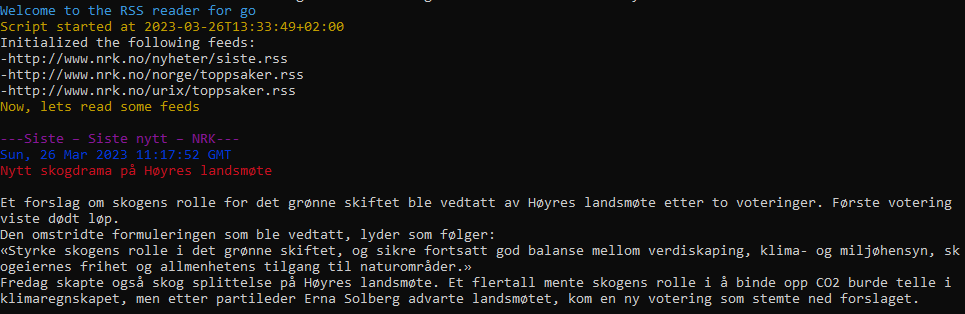

# go.rss #

RSS-feed parser for the command line, written in Go  



## Usage

```go
go run rssFeeds.go -h
  -file string
        Path to configurationfile containing RSS-feed URLs
  -history int
        How far back would you like to get feed-items for? default is 0

//Run with
go run rssFeeds.go -file feeds.txt -history 1

//To build executable for your current platform, use:
go build rssFeeds.go 

```
## Dependenies
Uses these great modules:  
https://github.com/fatih/color  
https://github.com/mmcdole/gofeed